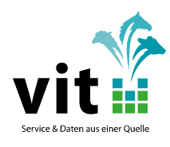

My background is a **statistical geneticist*   * within R&D department. I have over 11 years working on statisticalgenetics and bioinformatic areas. Where my responsibilities included Lead and direct activities that delivermolecular tools and genomic analyses to achieve genetic gains, competitive advantage and business objectives.Develop or utilize existing genomic tools and methods to improve genetic gain in pedigree; develop or utilizeexisting genomic tools and methods to improve selection in product pipeline; develop or utilize genome toolsand methods to understand genetic resources and relationships; identify genes and mutations associated withunderstand traits; implement genomic tools into the pedigree and product pipeline; provide ongoing requirementsfor the genomic R&D database; increase knowledge in genomic research.

### **Research Interesting**:

   * Bioinformatic, Statistical computing, and statistical graphics.  
   * Exploratory Data Analysis, in particularly of big Data analysis.  
   * Develop statistical method and program to analyze next generation sequence data sets and RNA-seq in humanand animal.  
   * Population genomic studies using high density SNP data, numerical and statistical methods with applications ingenomic selection.  
   * Quantitative genetics for complex traits.  
   * Whole genome annotation and pathway analyses.  
   * Data visualization, distributed computing technology and reproducible research.  
   * Cloud computing, version control, electronic notebooks and containerization technologies.  

## **Experience**

### Statistical Geneticist
   
[Cobb-Vantress](https://www.cobb-vantress.com/) 2013 - Present 

   * Researching, adapting, and implementing cutting edge statistical genetics approaches for analysesand interpretation of large scale proprietary and publicly available genomic data.  
   * Data processing and conducting QC on large scale Next Generation Sequencing datasets.  
   * Developing and documenting statistical and computational genomics analysis plans using the newestmethods and pipelines to interrogate whole-exome and whole-genome sequence data in combinationwith other genomic and phenotypic data to enable the identification of causal genetic determinants ofdisease  
   * Conducting robust statistical and computational genomics analyses, for common and rare variants,genome-wide association studies, and integrative genomic studies that incorporate sequence andexpression data, analysis of RNAseq data for calculating differential gene expression  
   * Fine mapping and locus dissection to assist in target identification, including leveraging public andproprietary genomic functional annotations.  
   * Interpretation and communication of key findings  
   * Experience with Genome Analysis Toolkit (GATK) and similar variant calling pipelines  
   * Experience operating in a cloud platform (AWS, Google Cloud, Azure)  
   * Experience with version control, electronic notebooks (Jupyter or Rnotebook)  
   * Experience using containerization technologies (Docker) for reproducible research  
   * Experience working with controlled access data from public repositories, such as a dbGaP and the UK BioBank  
   * Experience with Mendelian Randomization and/or multi-phenotype analyses.  
   * Experience operating in a large-scale, distributed computing environment  

### Research Scientist
   
[Cobb-Vantress](https://www.cobb-vantress.com/) 2012 - 2013

   * Next Generation Sequencing Data Analysis for individual and pool sequencing data.  
   * RNA-seq data analysis.  
   * Imputation for genomic selection using 60K and 3K chip.  
   * Comparative genome analysis.  
   * Molecular diagnose method for complex disease (Prediction Model).  
   * Genetic architecture analysis.  
   * Parentage testing using small marker panel.  
   * Genome wide association study for case control and complex trait using SNP chip and NGS data.  
   * Chicken genome annotation and functional prediction.  
   * Python, Perl, Shell and R programming and graphing.  

### Postdoc
  
[Tulane University, USA](https://tulane.edu/) 2011 - 2012 

   * Expertise with genome scale analyses with genotype or sequence data. Execute and interpret analyses of genome wide association analysis, with sequencing or genotyping data.  
   * Expertise in groundbreaking genomic analyses and their application to complex human and animal
traits. Using cutting edge statistical genetic analysis methods to generate insights about human
disease. Approaches that are currently being employed include genome-wide association analysis,
exome-wide association analysis, rare variant analysis, meta-analysis, and the use of functional data to
prioritize variants and genes of interest.  
   * Expertise with modern cluster and cloud computing environments. Routinely using advanced tools for
genomic analyses (PLINK, GATK, samtools, Minimac, etc.) and for statistical analyses and computation
(R, python, C/C++, Javascript) to execute analyses at scale.  
   * Ability to work in a highly interactive environment with a diverse team of colleagues.  
   * Outstanding communication skills and an ability to summarize and present the results of human and
animal genetic studies to a variety of technical audiences, ranging from specialists in statistical genetics
and computation to specialists in biology, and medicine.  

### Reseach Scientist  
  
[Vereinigte Informationssysteme Tierhaltung w.V. Germany](https://www.vit.de/) 2011 - 2011 

   * A solid foundation in genomics or bioinformatics.  
   * Automate pipeline create.  
   * Automate report create.  
   * Familiar with imputation and genomic selection techniques  
   * High Density (700K), 60K and 3K genotyping chips Imputation for thousands of Animals.  
   * SAS, Fortran and Linux shell programming.  

### Postdoc
  
[Goerg August University, Germany](https://www.uni-goettingen.de/en/1.html) 2009 - 2011    

   * Genomic prediction models.  
   * Genomic selection methods comparison. such as Bayes, Machine learning, Mix models.  
   * Mendelian sampling term effects in genomic selection.  
   * Simulation study in traditional model and genomic prediction model.  
   * R programming and visualization.  

## **Education**
### [Georgia Institute of Technology](https://www.gatech.edu/)  
  
Master's degree in Analytics, Computational Data Analytics
2019 - 2021

   * Knowledge in Regression, Simulation, Timeseries Analysis, Analytic Models.  
   * Knowledge in Bayes analysis, Business and marketing simulation.  
   * Experience operating in big data analysis.  
   * Experience operating in machine learning and deep learning.  
   * Experience operating in database operations.  
   * Experience operating in distribute computing, Hadoop. Pyspark.  
   * Experience operating in a cloud platform (AWS, Google Cloud, Azure)  
   * Experience with version control, electronic notebooks (Jupyter or Rnotebook)  
   * Experience using containerization technologies (Docker) for reproducible  research  

### [China Agricultural University](https://en.cau.edu.cn/)  
  
Doctor of Philosophy (PhD), Statistical Genetics
2004 - 2009

### [China Agricultural University](https://en.cau.edu.cn/)   
  
Bachelor’s Degree
2000 - 2004

### **Project List**

   * D3 for Force-directed graph layout [documentation](https://github.com/chenjunonly/home/blob/main/_posts/2020-11-02-Tidyverse-Cheat-Sheet.pdf).  
   * Regression project  
   * deep learing. 
